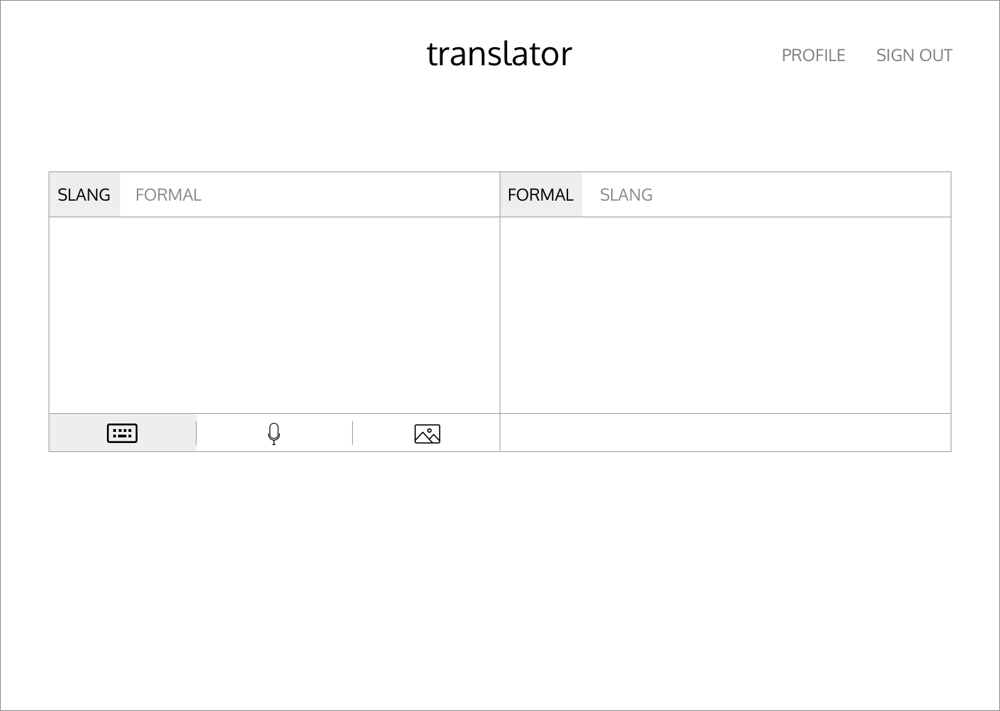
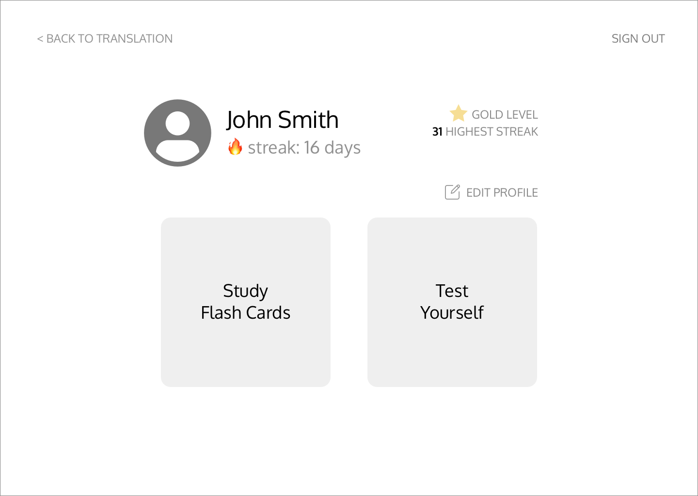

# Team Name: 3STRIPES

## Team Members
Edward Chen, Eunice Chan, Nathaniel Qin, and Sumeet Bansal

## Project Proposal
### Project 1: Slang Translator
Our project aims to help bridge the gap between parents and older generations who feel disconnected from their children or other people in younger generations. The application serves to help translate English words and sentences containing slang into pure, formal English. Additionally, users of the application will be able to continually practice slang with flash cards and customized tests.

None of us consider ourselves to be out of touch with modern slang, but we can see how older generations might see this as an obstacle in developing relationships with younger people. We hope to help address this need with our application by making this information more accessible.

### Project 2: ASL Translator
Another project that we were considering is a version of an ASL translator that might be useful in urgent situations when a better option either is not available or would take too long. The premise of the application is for ASL signers to be able to sign alphabetical letters into a camera, which is then translated into written English. This way, Deaf people or ASL signers in general would have a way to communicate with people who do not know ASL.

None of us are Deaf, and none of us know how to sign ASL. We believe that this is a project that could have great benefits for people who are unable to  

## Possible APIs & Datasets
### APIs
* [Google Cloud - Speech to Text](https://cloud.google.com/speech-to-text/)
* [Google Cloud - Text to Speech](https://cloud.google.com/text-to-speech/)
* [Google Cloud - Vision](https://cloud.google.com/vision/)
* [Twilio API](https://www.twilio.com/)
* [Twitter API](https://developer.twitter.com/en/docs.html)
* [Urban Dictionary API](https://github.com/zdict/zdict/wiki/Urban-dictionary-API-documentation)

### Datasets
* [ASL Alphabet Dataset](https://www.kaggle.com/grassknoted/asl-alphabet)
* [Reddit Comments Dataset](https://www.kaggle.com/datasets?tagids=12043)
* [Urban Dictionary Dataset](https://www.kaggle.com/therohk/urban-dictionary-words-dataset)

### Other
* [Natural Language Toolkit](https://www.nltk.org/)

## Storyboards
### Storyboard 1: ASL Translator
In this scenario, a new coworker is unable to communicate with his other coworkers because they do not know ASL. The usage of our application helps to bring connection.

### Storyboard 2: Slang Translator
In this scenario, the parent is unable to understand the things that their child has posted on social media. Our application could help bridge this gap.

## Prototypes
### Prototype 1: ASL Translator
The application is rather simple, allowing someone to sign the ASL alphabet into the camera to be translated into written English.

### Prototype 2: Slang Translator
With this application, not only can users translate from slang to English (or vice versa), but they can also study slang words and be tested on their knowledge in order to be better educated.

