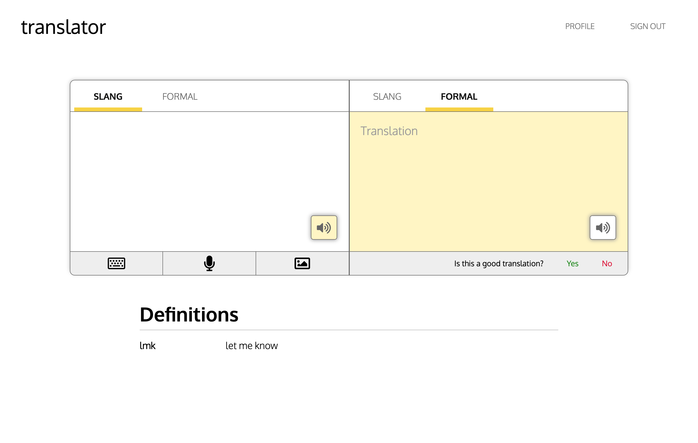
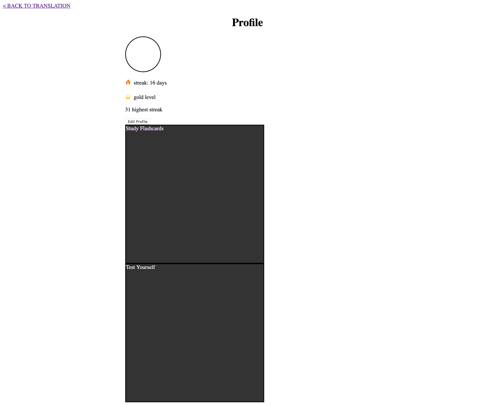
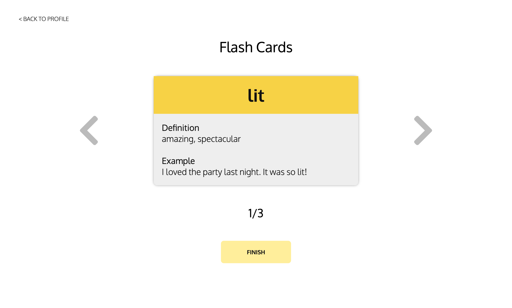
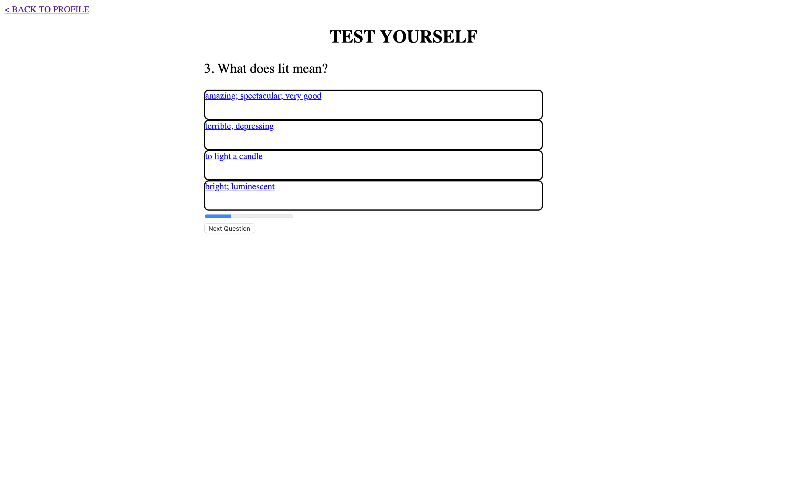

# Team Name: 3STRIPES

## Team Members
Edward Chen, Eunice Chan, Nathaniel Qin, and Sumeet Bansal

## Final Project Idea
In Milestone 1, our team proposed a Slang Translator and a ASL Translator. After looking over the TA feedback, we chose to move forward with the Slang Translator because the ASL Translator may not provide sufficient benefits to warrant a stand-alone app. In general, most people (including ASL signers) have the ability to type on a keyboard or write on paper as a means of communicating across a language barrier. On the other hand, slang is not something that is easily translated, so we decided that this option would yield more value.

## UI Skeleton
In our UI skeletons, all of the original features that were shown on our prototypes were incorporated into our UI skeleton. We felt that the prototype itself was rather full, and included many of the future functionalities that we hope to implement. As we fleshed out our skeletons, we still added some changes, although they were quite minor.

### Home Page
 

 
In our home page, we included text to speech buttons on both sides of the translator so that users can listen to how both slang and formal language is pronounced. We also made the right side yellow to indicate that it is the translation side. It also displays "Translation" by default when nothing has been inputed so the user understands the right side of the translator produces the translations.

### Profile Page
 

 

### Study Page
 

 
On the flash card page, we simply added a counter at the bottom to help the user keep track of the flash card that they are currently viewing. We also moved the previous and next buttons to be directly next to the flash card as we felt that it was more intuitive and easy to use.

### Test Page
 

 
