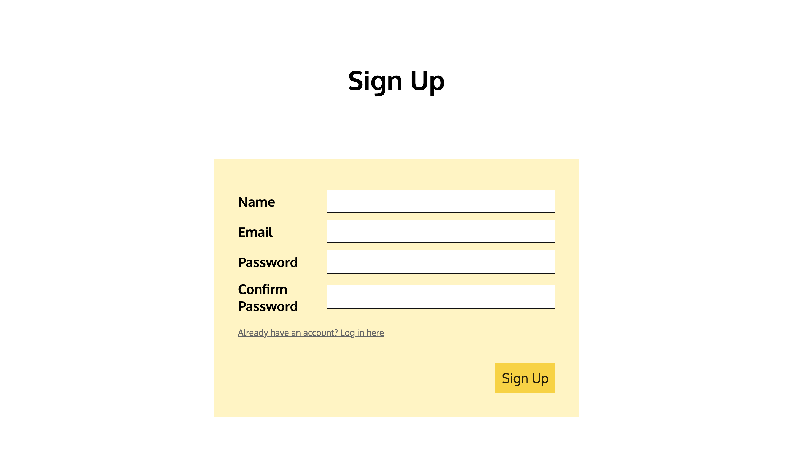
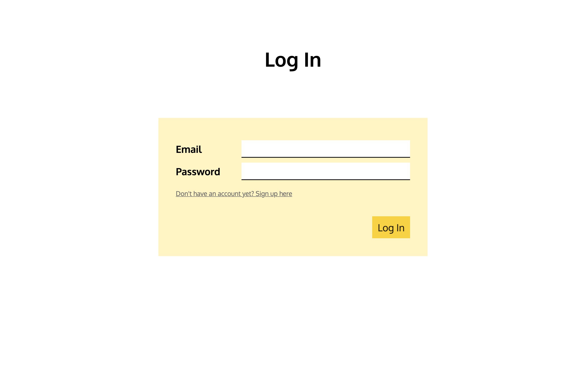
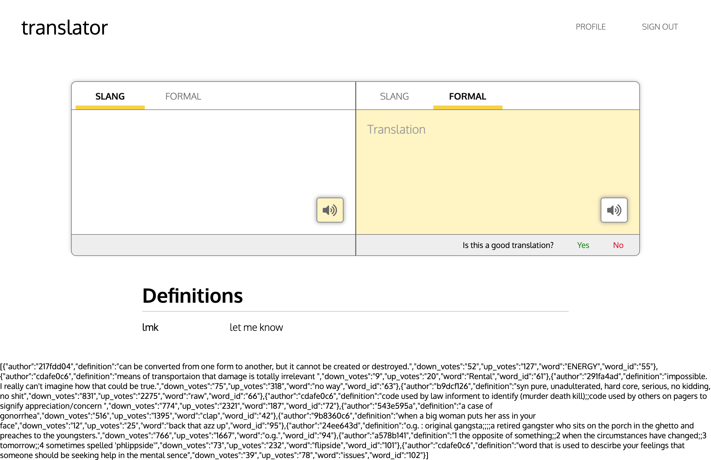
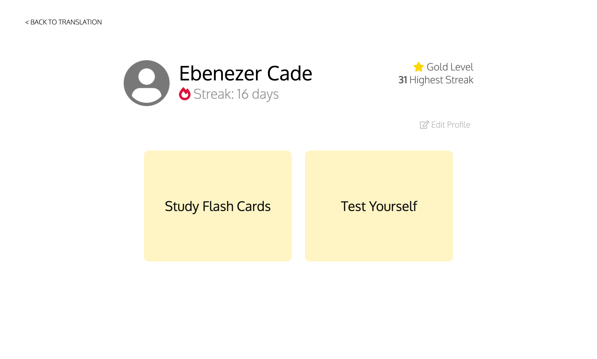
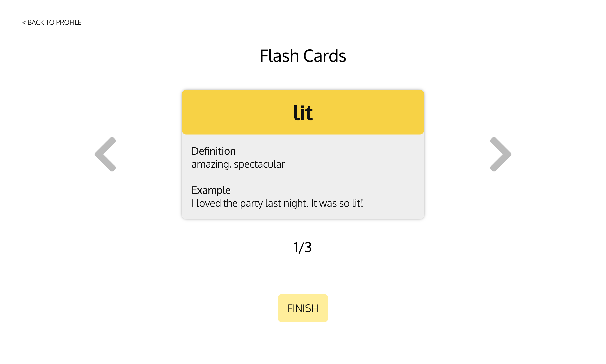
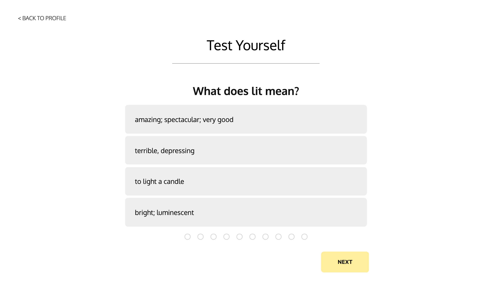

# Team Name: 3STRIPES

## Team Members
Edward Chen, Eunice Chan, Nathaniel Qin, and Sumeet Bansal

## Current UI Skeleton
For our UI, the two pages that we completed for milestone 2 have remained largely the same. There are only a few minor changes that reflect the changes that we have decided to go forward with on the backend.

### Signup Page
 

 

### Login Page
 

 
We decided to add separate pages for both sign up and log in, rather than what we had previously planned which was just a separate modal that would pop up on the home page. We chose to do this mainly because it's easier and it also keeps our code less cluttered for authentication.

### Home Page
 

 
On our home page, we simply removed the icons that we originally had on the left footer. These were originally features that we planned to incorporate regarding text input (e.g. image-to-text, speech-to-text), but after exploring these ideas more in the backend, we decided that they were too complicated to implement. We still retained the text-to-speech function, however.

### Profile Page
 

 
We cleaned up our profile page a lot more to look like the prototype. We've yet to extensively test all of the database-related features we want to incorporate into this page, so it's likely that this page will undergo some changes as we proceed as well.

### Study Page
 

 
This page is the same as milestone 2.

### Test Page
 

 
We cleaned up this page as well to better match the original prototype. We did change things from the prototype however, in that we will only be allowing users to advance forward in the questions, rather than what we had planned before which allowed them to maneuver freely forwards and backwards between the questions.

## Backend Technologies
Our team decided to move forward with using Google Firebase for deploying our web application and data storage. We decided to use Google Firebase because it offers a built in user authentication framework that could be easily integrated within our application. To help with the slang translations, we decided to use a few more APIs including: Twitter's API for gathering sentences that potentially contained slang, UrbanDictionary's API for getting definition of slang words, Datamuse's API for performing a reverse definition look-up, and spaCY Named Entity Recognizer model for detecting slang within text.
