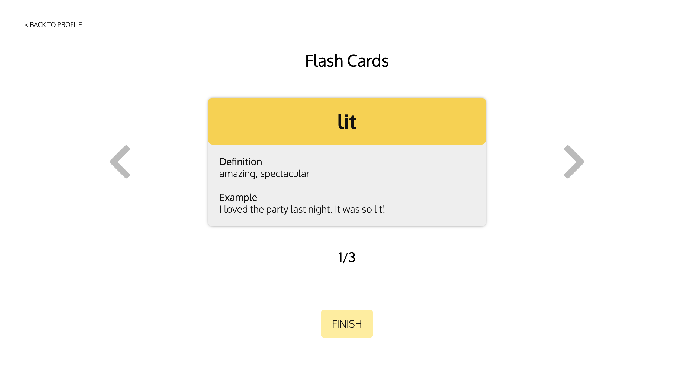

# Team Name: 3STRIPES

## Team Members
Edward Chen, Eunice Chan, Nathaniel Qin, and Sumeet Bansal

## UI Progress
### Login & Signup Pages

Due to the incorporate of Firebase, we removed our login and signup pages. Instead, we will be using the login/sign-up pop-up window that Firebase provides for authentication.

### Home Page
 

 
This page is the same as milestone 3.

### Profile Page
 

 
This page is the same as milestone 3.

### Study Page
 

 
This page is the same as milestone 3.

### Test Page
 

 
Despite some changes to the functionality, the appearance of this page remains the same. We now only allow users to proceed forward to the next question after they've selected an answer for the current question. Once they've submitted their answer, the page will then display the correct answer in green if the got it correct. If the user answered incorrectly, their incorrect answer will be in red and the correct answer will appear in green. At the end of the test, an alert will appear informing the user that they've reached the end of the test. 

## User Action 1: Translate Slang
Translating slang with the slang translator is our core functionality. On the home page, click on the left textbox and input the slang that you would like to be translated, and the translation will display in the right textbox.

## User Action 2: Study Flash Cards
Studying flash cards is a secondary functionality where the user can auto-generate and go through flash cards of previously defined slang terms. To go to "Study Flash Cards", on the home page, click on the top-right link labeled "Profile", then on the profile page, click on the lefthand side yellow box labeled "Study Flash Cards" to access the user's cards. From there, the user can view different flash cards by clicking through the arrows on either side of the flash card deck.
