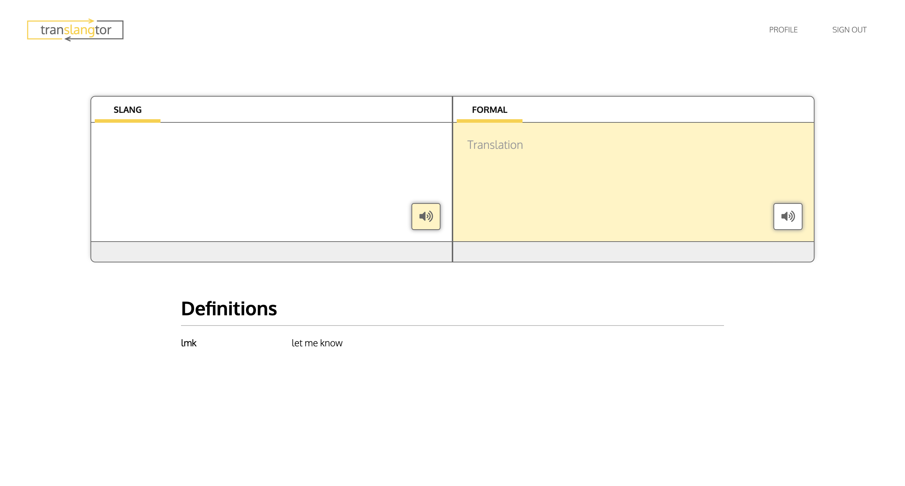
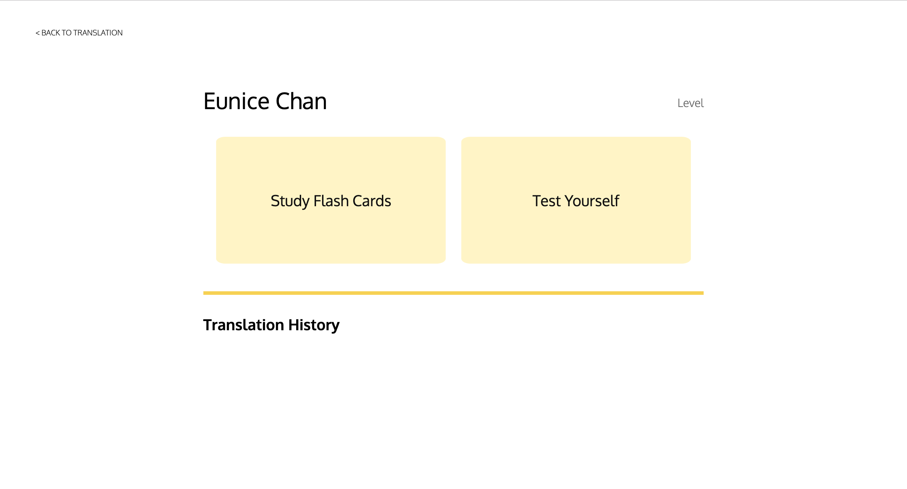
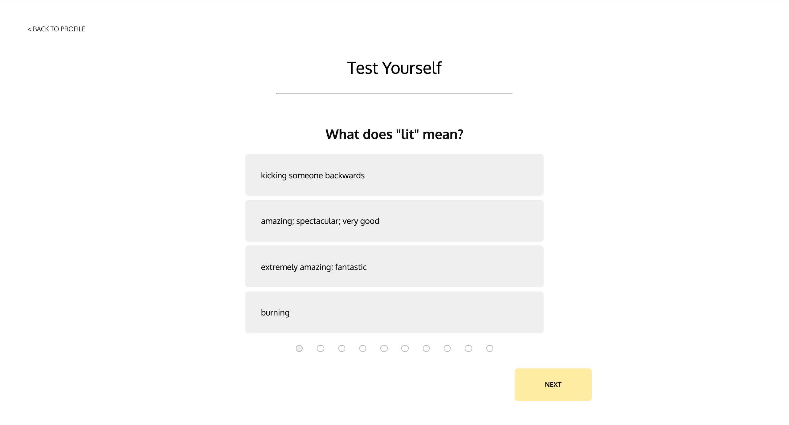
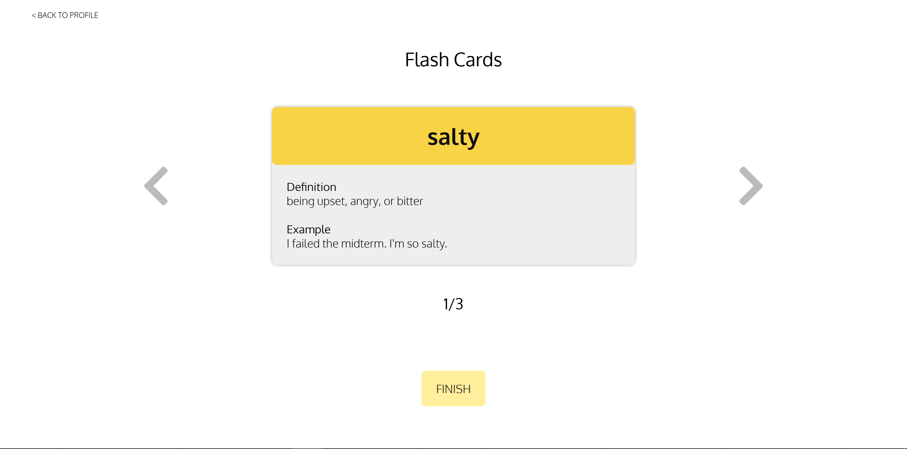
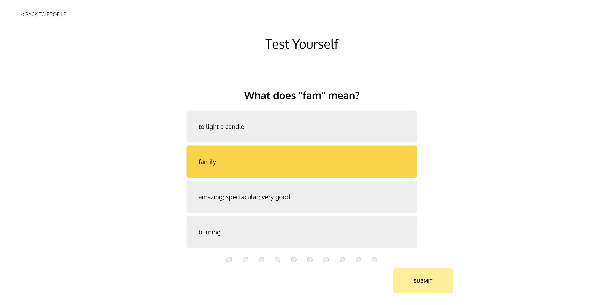

# Team Name: 3STRIPES

## Team Members
Edward Chen, Eunice Chan, Nathaniel Qin, and Sumeet Bansal

## UI Progress
### Home Page
 

 

This page is almost the same as milestone 4. In this iteration, we replaced the words "translator" at the top left corner with the logo of our application "Translangtor". We also removed "Is this a good translation?" at the bottom of the right input box due to difficulties with the implementation. 

### Profile Page
 

 

In this page, we removed the placeholder name and replaced it with the user's name when they login through Firebase. We also removed the edit profile portion because we realized there isn't any feature to edit in the profile. We also removed the "streak" feature because we found it to not be a necessary for the profile portion. We also added a translation history that will continue to accumulate words that the user has inputted to be translated. 

### Study Page
 

 

This is the same as milestone 4.

### Test Page
 

 

This is the same as milestone 4.

### Data Visualization
Our Firestore data is visualized in our Study Flash Cards and Test Yourself functionalities, pictured below in that order:

Since our app is intended to be educational, flashcards and multiple-choice questions align with our purpose and provide easily understood formats for students/users to educate themselves. All data displayed in the flashcards and multiple-choice questions come from Firestore, where we have [`question-set`](https://firestore.googleapis.com/v1/projects/cogs121-c88c5/databases/(default)/documents/question_set/) and [`flashcards`](https://firestore.googleapis.com/v1/projects/cogs121-c88c5/databases/(default)/documents/flashcards/) collections.

We implemented our data displays using AJAX requests to retrieve data, some additional JavaScript to parse the data from its Firebase format, and vanilla HTML/CSS to display the flashcards and test questions. We did not use any libraries/frameworks for the data display.

## Ambitious Data Visualization
Future releases would prioritize user-specific features, e.g. a history of translations and statistics such as commonly-translated words (for the user and regionally/globally). The translation history could be a simple two-column table with original inputs and then translations, which we could fold into our current AJAX request every time a translation is made, and the user statistics could be implemented using some more complex Firebase queries and a data visualization library such as [D3.js](https://d3js.org/).

## Purpose of "Translangtor"
The purpose of our slang translator would aid non-millenials, such as parents, in understanding current slang that they may be unfamiliar with. 
For example: Janine, while relaxing at home, noticed her son tweeted the word "lit" on Twitter as she was scrolling through social media. 
Janine doesn't know what "lit" means. Concerned that he might be using profanity that she's unaware of, Janine grabs her laptop 
and searches for the "Translangtor". She logs into her account through Google and types in "lit" into the translator. After a couple seconds, 
the words "amazing; spectacular; very good" display on Janine's screen. Relieved that her adolescent son isn't using profanity on Twitter, 
Janine closes her laptop and continues to go about her day. 

